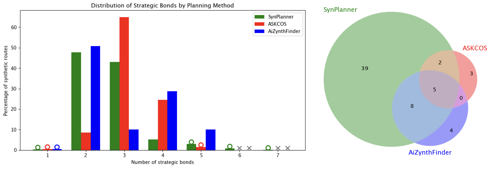
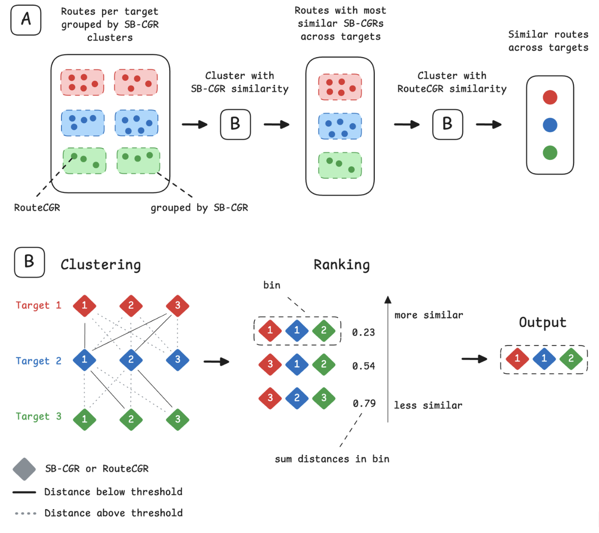
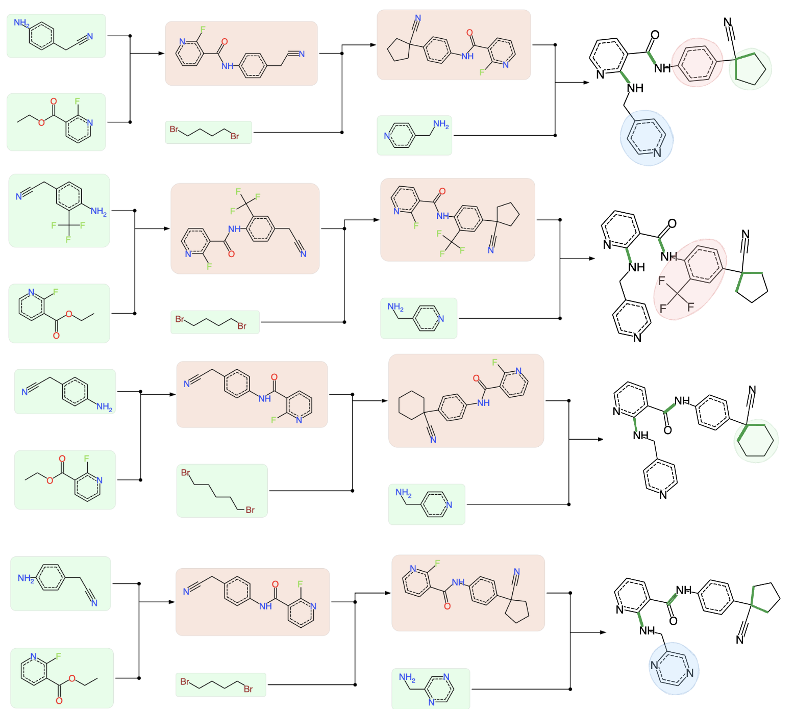

# routecluster-benchmark

Benchmarking retrosynthetic route clustering and extending it to cross-target route family discovery.

This repository now combines two previously separate storylines:

1. **Benchmarking clustering methods on single-target route sets**
2. **Cross-target comparison of route families with hierarchical filtering**

In practical terms, the benchmark establishes robust route clusters (strategy-level and route-level), and the cross-target workflow uses those representations to find similar synthetic solutions across related targets.

---

## What is included

### A) Benchmark workflow (single target)

Compare SB-CGR / Strategic Bond Pattern clustering against:

- AiZynthFinder TED (Tree Edit Distance)
- AiZynthFinder Atom-Bond (AB)
- ASKCOS Tree-LSTM embeddings

Goal: evaluate interpretability, granularity, and agreement across clustering paradigms.

### B) Cross-target workflow (multi target)

Two-level filtering for analogue/series-level route comparison:

1. **SB-CGR screening** (strategy-level consistency across targets)
2. **RouteCGR refinement** (route-level tactical/building-block compatibility)

Goal: avoid all-to-all combinatorial explosion while preserving chemically meaningful matches.

---

## Conceptual pipeline

`Route generation -> clustering benchmark -> SB/Route fingerprints -> cross-target ranking`

### Benchmark figures





### Cross-target figures





---

## Repository map

- `notebooks/benchmark/setup.ipynb`: data preparation and route-format normalization
- `notebooks/benchmark/askcos_cluster_lstm.ipynb`: ASKCOS Tree-LSTM clustering
- `notebooks/benchmark/aizynth_cluster_ab.ipynb`: AiZynthFinder AB clustering
- `notebooks/benchmark/aizynth_cluster_ted.ipynb`: AiZynthFinder TED clustering
- `notebooks/benchmark/inter_comparison.ipynb`: cross-method benchmarking and agreement analysis
- `notebooks/multitarget/multitarget_planning.ipynb`: cross-target selection workflow (SB-CGR -> RouteCGR)
- `notebooks/multitarget/analysis.ipynb`: inspection and analysis of cross-target ranked outputs
- `cgr_clustering/`: SB-CGR/SBP benchmark implementation
- `multitarget/`: cross-target search and planning utilities
- `config.yml`: planning/search configuration
- `old/`: local-only legacy backups (gitignored)

---

## Environment setup

This repo already provides `uv`-based environment targets.

```bash
git clone https://github.com/Laboratoire-de-Chemoinformatique/routecluster-benchmark.git
cd routecluster-benchmark

pip install uv

# Main environment: SBP + ASKCOS + common deps + multitarget workflow
make uv-main
source .venv/bin/activate

# AB-specific AiZynthFinder environment
make uv-ab
source .venv-ab/bin/activate

# TED-specific AiZynthFinder environment
make uv-ted
source .venv-ted/bin/activate
```

Why multiple envs: AB and TED use different AiZynthFinder versions (`pyproject.toml` extras `ab` and `ted`).

---

## Run workflow A: benchmark

In `.venv`:

```bash
source .venv/bin/activate
jupyter notebook notebooks/benchmark/setup.ipynb
jupyter notebook notebooks/benchmark/askcos_cluster_lstm.ipynb
```

In `.venv-ab`:

```bash
source .venv-ab/bin/activate
jupyter notebook notebooks/benchmark/aizynth_cluster_ab.ipynb
```

In `.venv-ted`:

```bash
source .venv-ted/bin/activate
jupyter notebook notebooks/benchmark/aizynth_cluster_ted.ipynb
```

Back in `.venv`:

```bash
source .venv/bin/activate
jupyter notebook notebooks/benchmark/inter_comparison.ipynb
```

Expected benchmark outputs are stored in `inter_comp_data/` as method-level cluster assignments and comparison artifacts.

### Reproducible route-count timing experiment

The notebook search tree lives only in memory. Export the same solved-route set before
running the command-line checks:

```bash
source .venv-ab/bin/activate
python scripts/export_aizynth_routes.py \
  --config config.yml \
  --output benchmark_results/aizynth_routes.json

python scripts/check_trans_error_clusters.py \
  benchmark_results/aizynth_routes.json \
  --expect-clusters 17 \
  --compare-disabled

python scripts/benchmark_route_scaling.py \
  benchmark_results/aizynth_routes.json \
  --repeats 3 \
  --methods sb-cgr ab ted \
  --output-dir benchmark_results/route_scaling
```

The scaling script writes raw measurements, median summaries, log-log scaling fits,
and a wall-clock plot. SB-CGR extraction, reduction, clustering, and total time are
reported separately; AB and TED are measured as complete distance-matrix
computations. By default, the largest timing sample is the full exported route set.
The saved benchmark notebook contains 230 unique routes; current AiZynthFinder
versions can deduplicate the same 712 solved leaves to 229 routes.

---

## Run workflow B: cross-target route comparison

In `.venv`:

```bash
source .venv/bin/activate
jupyter notebook notebooks/multitarget/multitarget_planning.ipynb
jupyter notebook notebooks/multitarget/analysis.ipynb
```

The multi-target module (`multitarget/`) applies beam-search filtering at both levels:

- strategy tuple selection among SB-CGR clusters
- route tuple selection among RouteCGR members of selected strategy bins

### Typical parameter defaults

| Parameter | SB-CGR stage | RouteCGR stage | Purpose |
|---|---:|---:|---|
| `min_sim` | 0.75 | 0.80 | minimum pairwise Tanimoto threshold |
| `beam_width` | 8000 | 600 | max partial candidates retained |
| `top_k` | 10000 | 100 | number of top tuples kept |

---

## Outputs

After running both workflows, you obtain:

- benchmark cluster assignments for SBP, TED, AB, and Tree-LSTM
- cross-method agreement diagnostics (e.g., overlap matrices, ARI)
- ranked cross-target route tuples that are strategy-consistent and tactically similar

---

## Figures and folder layout

Figures are consolidated under:

```text
assets/
  figures/
    benchmark/
      route_cgr.png
      sb_cgr.png
      benchmark_combined.png
      strat_bond_dist.png
      wenn_benchmark.png
    multitarget/
      hierarchical_cross_target_pipeline.png
      output_routes.png
```

All README figure links now point to these canonical paths.

---

## Notes and limitations

- RouteCGR-level similarity can be sensitive to leaving-group substitutions in otherwise similar routes.
- Stage 1 is intentionally strategy-first; Stage 2 adds tactical discrimination.

---

## Citation

If you use this repository, cite:

- Gilmullin et al., *Leveraging Condensed Graph of Reactions for Clustering Retrosynthetic Pathways*, ChemRxiv (2025), DOI: `10.26434/chemrxiv-2025-lnkz6-v2`.

Also cite core benchmark baselines where relevant:

- Mo et al., *Chemical Science* 2021, 12, 1469-1478 (Tree-LSTM strategy clustering)
- Genheden et al., *J. Chem. Inf. Model.* 2021, 61, 3899-3907 (TED route clustering)
- Genheden and Shields, *Digital Discovery* 2025, 4, 46-53 (route similarity metric)

---

## License

MIT (see `LICENSE`).
