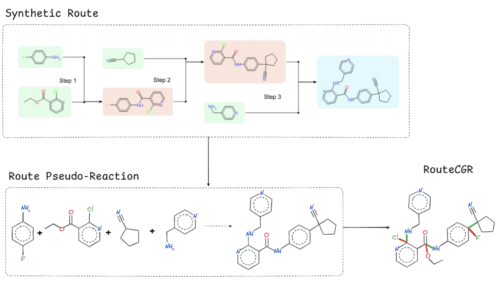
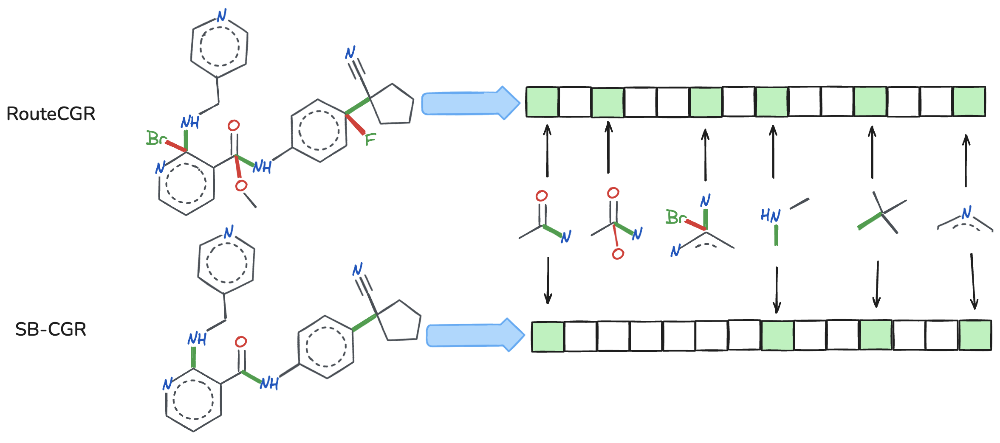
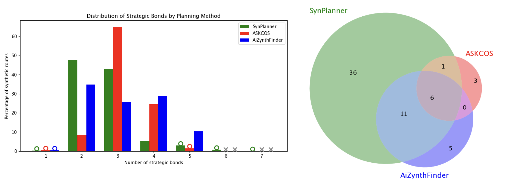

# routecluster-benchmark 🧪🔬

**Benchmarking retrosynthetic route clustering — SBP (SB-CGR) vs TED vs Atom–Bond vs Tree-LSTM**

This repository is a **benchmarking suite** to compare clustering of **retrosynthetic routes (synthetic pathways)** generated by common CASP tools (**AiZynthFinder**, **ASKCOS**).
It evaluates **SB-CGR / SynPlanner SBP clustering** against three widely used clustering approaches:

* **AiZynthFinder — TED** (*Tree Edit Distance*)
* **AiZynthFinder — Atom–Bond (AB)** similarity clustering
* **ASKCOS — Tree-LSTM** embedding-based clustering

📄 **Companion paper (ChemRxiv):**
**Leveraging Condensed Graph of Reactions for Clustering Retrosynthetic Pathways**
DOI: **10.26434/chemrxiv-2025-lnkz6-v2**
[https://doi.org/10.26434/chemrxiv-2025-lnkz6-v2](https://doi.org/10.26434/chemrxiv-2025-lnkz6-v2)

---

## Why this benchmark?

Modern retrosynthesis planners can output **hundreds to thousands of candidate routes per target**, which quickly becomes hard to interpret. Clustering helps compress this route space into a **small set of representative strategies**.

This benchmark is designed to assess clustering methods in terms of:

* **Interpretability** (*strategic disconnections vs minor route differences*)
* **Granularity** (*few strategy-level clusters vs many fine-grained clusters*)
* **Robustness** to protecting groups / leaving groups / step order
* **Agreement** across methods (overlap matrices, ARI, etc.)

---

## SB-CGR / SBP in one glance ✨

**SBP (Strategic Bond Pattern)** clustering groups routes by the **key bonds formed/broken in the target**, i.e., the *core retrosynthetic strategy*, while remaining tolerant to tactical variations (reagent choices, step ordering, etc.).

> **Intuition:**
> If two routes “disconnect the same strategic bonds,” they should land in the same cluster — even if the paths look different step-by-step.

---

## Figures (from the paper)

### RouteCGR composition



### RouteCGR and SB-CGR Morgan fingerprints generation



### Benchmark summary (tool comparison)



---

## Repository contents

Main entrypoints are **Jupyter notebooks**:

* `setup.ipynb`
  Prepare inputs and unify route formats for benchmarking.

* `askcos_cluster_lstm.ipynb`
  Clustering using **ASKCOS learned route strategy** (Tree-LSTM).

* `aizynth_cluster_ab.ipynb`
  **AiZynthFinder Atom–Bond (AB)** clustering.

* `aizynth_cluster_ted.ipynb`
  **AiZynthFinder Tree Edit Distance (TED)** clustering.

* `inter_comparison.ipynb`
  Compare cluster assignments across all methods (overlap, metrics, plots).

Additional code:

* `cgr_clustering/`
  SB-CGR / SBP clustering implementation used for the SBP baseline.

* `config.yml`
  Central configuration (paths, method settings, output controls).

---

# Quickstart 🚀

## 1) Clone

```bash
git clone https://github.com/Laboratoire-de-Chemoinformatique/routecluster-benchmark.git
cd routecluster-benchmark
```

## 2) Create uv environments

You will typically want **two environments** because the **AiZynthFinder TED notebook requires a different AiZynthFinder version** than the Atom–Bond workflow. The repository includes a `pyproject.toml` and a `Makefile` with `uv` targets for each environment.

### ✅ Install uv (one-time)

```bash
pip install uv
```

### ✅ Main environment (SBP + ASKCOS + common deps)

```bash
make uv-main
source .venv/bin/activate
```

### ✅ Atom–Bond environment (AiZynthFinder AB)

```bash
make uv-ab
source .venv-ab/bin/activate
```

### ⚠️ TED environment (AiZynthFinder TED)

```bash
make uv-ted
source .venv-ted/bin/activate
```

> **Important note:**
> `aizynth_cluster_ted.ipynb` **must be run in its own environment** because the AiZynthFinder version required for the **TED method** differs from the one used for the **Atom–Bond method**.

---

# Run the benchmark ✅

### Step 0 — Prepare routes / inputs

Run in the **main uv env**:

```bash
source .venv/bin/activate
jupyter notebook setup.ipynb
```

### Step 1 — Run each clustering method

#### ASKCOS (Tree-LSTM)

Run in the **main uv env**:

```bash
source .venv/bin/activate
jupyter notebook askcos_cluster_lstm.ipynb
```

Notes:
* Expects ASKCOS route JSON files downloaded from the web interface (see notebook header).
* Writes cluster output to `inter_comp_data/askcos_clusters.pkl`.

#### AiZynthFinder (Atom–Bond / AB)

Run in the **AB uv env**:

```bash
source .venv-ab/bin/activate
jupyter notebook aizynth_cluster_ab.ipynb
```

Notes:
* Uses AiZynthFinder **AB-compatible** version.
* Writes cluster output to `inter_comp_data/aizynth_clusters.pkl`.

#### AiZynthFinder (TED)

Run in the **TED uv env**:

```bash
source .venv-ted/bin/activate
jupyter notebook aizynth_cluster_ted.ipynb
```

Notes:
* Uses AiZynthFinder **TED-compatible** version.
* Writes cluster output to `inter_comp_data/aizynth_sb_clusters_ted.pkl`.

### Step 2 — Compare outputs across methods

Back to the **main uv env**:

```bash
source .venv/bin/activate
jupyter notebook inter_comparison.ipynb
```

This comparison notebook is typically where you’ll generate:

* cluster overlap tables / contingency matrices
* agreement scores (e.g., ARI)
* benchmark plots used in the manuscript

---

## What you get 📦

After completing the workflow, you will have:

* cluster assignments per method (**SBP**, **TED**, **AB**, **Tree-LSTM**)
* comparison diagnostics between methods
* plots summarizing how each method partitions the same set of routes

---

## Methods benchmarked

### SynPlanner / SBP (SB-CGR)

**Strategy-first clustering:** routes are grouped by **Strategic Bond Patterns** in the target, using SB-CGR descriptors.
Best when you want **human-interpretable strategy clusters**.

### ASKCOS (Tree-LSTM)

**Learned strategy clustering:** routes are embedded using a tree-structured LSTM model and clustered in latent space.
Good for modeling route similarity, but sometimes harder to interpret chemically.

### AiZynthFinder (TED)

**Tree Edit Distance clustering:** hierarchical clustering using a route tree similarity metric.
Algorithmic and deterministic, but can be sensitive to structural route-tree differences.

### AiZynthFinder (Atom–Bond / AB)

**Bond-change similarity clustering:** compares bond/atom-level changes across routes to group them.
More chemically grounded than pure templates, often more computationally expensive.

---

## Configuration

All benchmark parameters are managed via:

* `config.yml`

Typical configurable items:

* dataset / route paths
* method settings (thresholds, clustering params)
* output file locations

---

## Citation

If you use this repository or SB-CGR/SBP clustering in your work, please cite:

**Primary paper**

* Leveraging Condensed Graph of Reactions for Clustering Retrosynthetic Pathways.*
  **ChemRxiv (2025)**. DOI: **10.26434/chemrxiv-2025-lnkz6-v2**

**Other essential references**

* Mo, Y.; Guan, Y.; Verma, P.; Guo, J.; Fortunato, M. E.; Lu, Z.; Coley, C. W.; Jensen, K. F.
  *Evaluating and clustering retrosynthesis pathways with learned strategy.*
  **Chemical Science** 2021, 12 (4), 1469–1478.

* Genheden, S.; Engkvist, O.; Bjerrum, E.
  *Clustering of Synthetic Routes Using Tree Edit Distance.*
  **J. Chem. Inf. Model.** 2021, 61 (8), 3899–3907.

* Genheden, S.; Shields, J. D.
  *A simple similarity metric for comparing synthetic routes.*
  **Digital Discovery** 2025, 4 (1), 46–53.

---

## License

MIT License (see `LICENSE`)

---

## Maintainers

**Laboratoire de Chemoinformatique (Strasbourg, France)**
[https://github.com/Laboratoire-de-Chemoinformatique](https://github.com/Laboratoire-de-Chemoinformatique)
